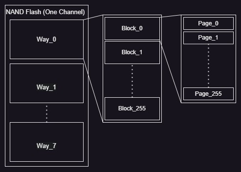

# Verilog-Project-NMC

  Contributor:

# Environment
  >[!IMPORTANT]  
  >  Vivado: 2019.1  
  >  SDK:    2019.1 

  IP Location:  
    1. Watershed version:   
    2. 8 channels version: 

# Wrapper Command Flow #

  ## 0. Information ##
  Before watching the below Section 1~3, you first know the flow for transfer data :
  ### 0.1. Top view  
  
  ### 0.2. NMC Flow  
  3 steps: Trigger, Check, & Transfer  

  

  ## 1. Trigger ##

  | Command | Physical address  | Data    |
  | :----:  | :----:            | :----:  |
  | Opcode  | 0x43Cx_4000       | 32'h1C4 |
  | Way     | 0x43Cx_4004       |Flash_Way|
  |Row Addr | 0x43Cx_4008       |B*256+P  |
  | -       | -                 | -       |
  |Ready    | 0x43Cx_3000       | 32'd1   |

  * ### Note: ### 
    1. Flash_Way: Unary type (8 bits)
    2. B: Block
    3. P: Page

  * ### NAND Flash Operation Information ### 
    Need to attention that "Nand Flash Control" receive the "Trigger Command",
    The next command signal cannot transfer to "t4c_hlper_x" because the page data are transmitted
    from "NAND Flash Physical page" to "NAND Flash Controller page buffer". 
  > [!TIP]  
  >  The "busy signal" in diff. place have indevidual name:     
  >  Q: This part have some problem about the real Busy signal is for what?  
  >  A: Now I think so represent which way is trigger and want to read from. 
  >  * NAND Flash Controller(v2nfc_x) : port (oReadyBusy[7:0])
  >  * Helper (t4nfc_hlper_x) : port (iReadyBusy[7:0])
  >  * Unet/Accelerator Wrapper :  
  
  ## 2. Check ##

  | Command | Physical address  | Data    |
  | ----    | ----              | ----    |
  | Opcode  | 0x43Cx_4000       | 32'h130 |
  | Way     | 0x43Cx_4004       |Flash_Way|
  | Status Report Address|0x43Cx_4008 | (1)|
  |Clear Status Report| (1)     | 32'h0   |
  |-        |-                  |-        |
  |Ready    | 0x43Cx_3000       | 32'h1   |

  ## 3. Transfer ##
  
  | Command | Physical address  | Data    |
  | :----:  | :----:            | :----:  |
  | Opcode  | 0x43Cx_4000       | 32'h338 |
  | Way     | 0x43Cx_4004       |Flash_Way|
  |Row Addr | 0x43Cx_4008       |B*256+P  |
  | -       | -                 | -       |
  |Ready    | 0x43Cx_3000       | 32'd1   |

  ### Report Information ###
  > [!IMPORTANT]  
  >  Q: What is "___ Report Address" & "___ Report " in the command?  
  >  A: Address that you can discuss with firmware & change the place. 
  >  * Report Address is for NFC to store the information in the specific place.  
  >  * Report is the real information for checking whether NFC can execute normally. 

  >[!INFOMTION]  
  > The below 3 Information need to use Read channel to read back the value.  
  > * ### Note!!  
  >   The flow before reading back the value need a claer step to check the memory  
  >   is put the correct value.
  > ### Status Report (1) ###
  > You may see different value, like 0x1FFC1 or 0x1C1C1, in  individual channel. However, the value generally in self channel is the same. The below information is explain how to konw the status:  
  > bit 0 -> completion flag of Read Status operation  
  > bit 1~8 -> result of Read Status operation  
  > bit 9~16 -> BusyReady value of way 0~7  
  >If you shift right statusReport by 1, you can find the result of Read Status.
  0x1FFC1 >> 1 = 0xFFE0
   

  I'm not sure whether now ECC error mode is open.
  If ECC error mode is open, check flow in firmware like the below step(2)(3): 
  > ### Error Info (2) ###  
  >   Only the upper 4 bytes is ecc ErrorInfoTable,  
  >   and the value threshold is 'd24 
  >   |  Type   | Error Info  |
  >   | :----:  | :----:      |
  >   | Normal  | 0x0000_0000 |
  >   | Error   | 0x1100_0000 |
  
  If ECC error mode is close, only check flow in firmware like the below step(3): 
  > ### Completion Report (3) ###
  >   |  Type   | Completion Report |
  >   | :----:  | :----:      |
  >   | Normal  | 0x0000_0001 |
  >   | Error   | 0x1100_0000 |

  ## Appendix
  For now temp. the report ref. Baseaddress
  
  | Command | Bseaddress  | Calculate real address|
  | ----    | ----        | ----                  |
  | (1)     | 0x1700_0100 | + 32  * c +　    w    |
  | (2)     | 0x1700_0200 | + 352 * c +　44* w    |
  | (3)     | 0x1700_0000 | + 32  * c +　 4* w    |
  | -       | -           | -                     | 
